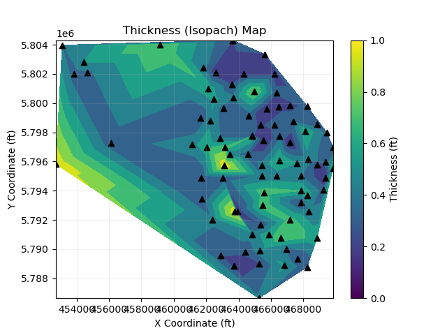
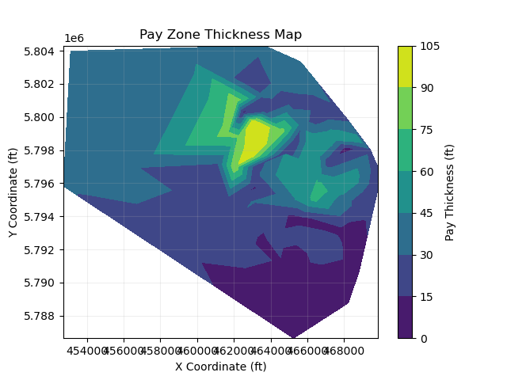
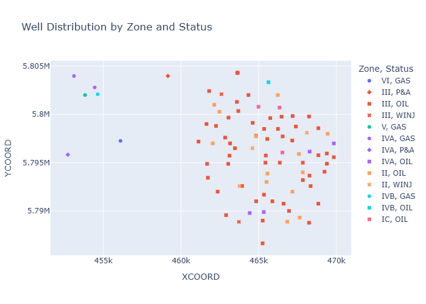

# Reservoir-Isopach-Mapping-and-Spatial-Analysis
This project focuses on reservoir characterization using spatial data to generate isopach maps and analyze pay distribution.  Isopach mapping is widely used in reservoir engineering to understand thickness variation, reservoir quality, and potential hydrocarbon zones.
# Reservoir Isopach Mapping and Spatial Analysis

## Overview
This project uses spatial data to generate isopach maps and analyze reservoir characteristics for oil and gas applications.

## Objectives
- Generate isopach (thickness) maps  
- Analyze pay zone distribution  
- Visualize well locations and status  
- Support reservoir characterization using data  

## Tools & Technologies
- Python  
- Pandas  
- Matplotlib  
- Plotly  

## Sample Visualizations

### Thickness Map

### Pay Zone Map

### Well Distribution

## Key Insights
- Reservoir thickness varies significantly across the field  
- High-pay zones indicate potential production targets  
- Well distribution reflects operational and geological constraints  
- Spatial analysis supports better field development decisions  

## Data
The dataset used in this project is not publicly available.  
A sample dataset is provided for demonstration purposes.

